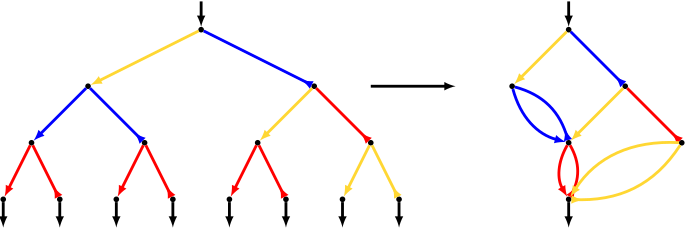

# Freebandlib

This repository contains reference implementations of the algorithms described
in the paper:

    R. Cirpons and J. D. Mitchell
    "Polynomial time multiplication and normal forms in free bands"

The following table gives the correspondence between the formal algorithm description in the paper and the implementation in `freebandlib`.

| Algorithm in paper          | Algorithm in `freebandlib` |
| --------------------------- | -------------------------- |
| `IntervalTranducer`         | `interval_transducer`      |
| `Minimize`                  | `transducer_minimize`      |
| `TrimTransducerIsomorphism` | `transducer_isomorphism`   |
| `EqualInFreeBand`           | `equal_in_free_band`       |
| `Multiply`                  | `multiply`                 |
| `MinWord`                   | `min_word`                 |

## To run the tests

Type:

    python3 -m pip install -r tests/requirements.txt

Then inside the `freebandlib` top level directory type:

    pytest

## To run the benchmarks

Download the benchmark sample data files (i.e. input data for the benchmarks).
To do so type:

    ./get_benchmark_sample_data.sh

Then type:

    python3 -m pip install -r benchmarks/requirements.txt
    make benchmark-all

It is also possible to generate entirely new benchmark sample data by using the
code in `benchmarks/generate_sample_data.py`. 

The benchmarks can then be parsed by running `python3
./benchmarks/extract_data.py`
